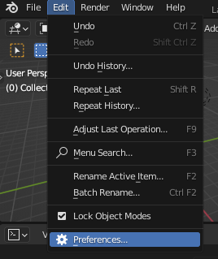
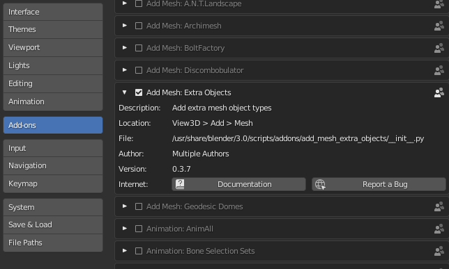
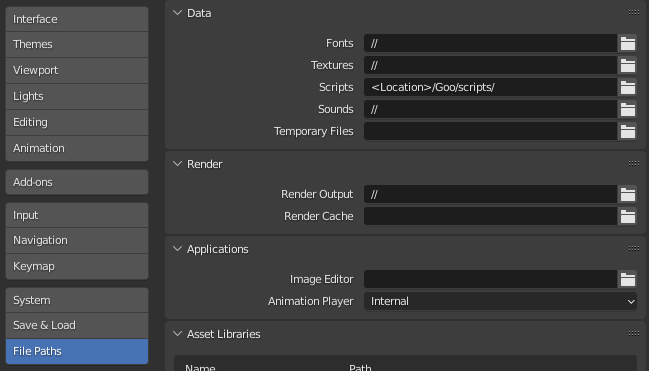

# Goo
Goo is a Python package for extending Blender for modeling biological cells, tissues, and embryos. 

Goo is a modeling environment for creating physics based simulations of biological cells, tissues, and whole embryos. Goo contains built-in models for basic cell properties such as growth, division, and adhesion. Goo creates realistic models of cells in 3D based on surface meshes enclosing compresible fluid. Goo is meant to fill a void in currently available models such as vertex and particle based models which are too simplified to capture essential featuers of cells, are often 2D, and can be difficult for new users to use.

Goo is built on top of Blender. Blender is a truly amazing open source computer graphics project for generating animations. Goo provides a library of helper functions in Python for creating cells with user defined properties that are used inside the scripting environment and GUI of Blender. Physics and rendering are handled by Blender. In combination Goo and Blender allow cell-based simulations to be interacted with via Python scripts and through a GUI.

Goo is open source and currently being developed by the <a href="http://www.digitalfish.org">Megason lab at Harvard University</a>. We would love for you to contribute! Please contact me if you are interested. megason AT hms.harvard.edu .

Our grand Driving Biological Problem is to simulate the first <a href= "https://www.youtube.com/watch?v=RQ6vkDr_Dec">24 hours of zebrafish development</a>. Our initial efforts are focussed on cleavage stage. We hope that Goo will be useful for simulating other biological tissues for understanding morphogenesis, embryonic development, growth of organoids, tissue engineering, and artificial life.

### Contributors
___
<li>Sean Megason, Harvard University
<li>Daniel Oo, Amherst University
<li>Kali Konstantinopoulos, Indiana University
<li>Michael Mitsch, Indiana University
<li>Drew Willis, Indiana University

### Installation
---
1. Install the latest edition of [Blender](https://www.blender.org/download/)
2. Clone the Goo repository or download and unzip
3. In Blender, go to `Edit>Preferences`, then go to the 'Add-ons' tab and enable the checkbox next to `Add Mesh: Extra Objects`





4. Then, in `Edit>Preferences`, go to the `File Paths` tab and add the `<location>/Goo/scripts/` folder to `Scripts`. `<location>` should be replaced with the root leading up to where you cloned the Goo repository. You may need to close and re-open Blender afther this change.




### Usage
---
In a new `General` Project within Blender, delete the default cube by left-clicking on the cube, type `X`, and then `return`

In the Scripting tab, use the desired cell functions

Example script (Create cell):
```
from Goo import Goo
Goo.setup_world()
cell = Goo.Cell(name_string = "Cell_", loc = (0, 0, 0))
Goo.make_cell(cell)
```
Click the play button and you should see a Goo cell appear
  
Note, Blender uses its own built in Python interpreter which may be different than another Python instance you've installed.
  
### Functions
---
